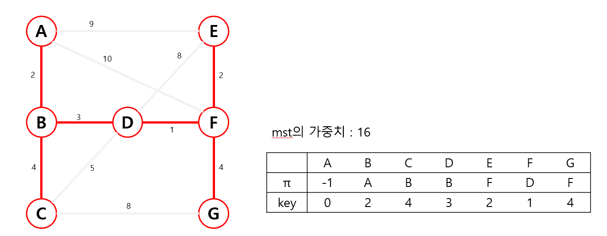

# Prim

### 개념

하나의 정점에서 연결된 간선들을 하나씩 선택하면서 MST를 만들어가는 방식

(* MST는 무방향 그래프에서 n개의 정점과 n-1개의 간선으로 이루어진 트리)

1) 임의의 정점에서 하나를 선택하여 시작
2) 선택한 정점과 인접하는 정점들 중에서 최소 비용의 간선이 존재하는 정점 선택
3) 모든 정점이 선택될 때까지 1 & 2 과정을 반복

**초기화**

- 가장 처음에는 초기 정점의 상태를 갖는 배열 정보를 초기화 
- 이때 기본 초기화는 무한대로 진행하는데, 실제 무한대가 아니라 문제의 범위를 살펴보고 해당 범위에 방해가 되지 않을 정도로 설정

| A    | B    | C    | D    | E    | F    | G    |
| ---- | ---- | ---- | ---- | ---- | ---- | ---- |
| inf  | inf  | inf  | inf  | inf  | inf  | inf  |

**Step 1.**

- 시작 정점 선택

- 어떤 점에서 시작해도 상관없지만 처음부터 시작하는 것이 일반적
- A 지점을 **시작 정점으로 설정하고 0**으로 초기화
- *현재까지 선택한 정점: A*

| A    | B    | C    | D    | E    | F    | G    |
| ---- | ---- | ---- | ---- | ---- | ---- | ---- |
| 0  | inf  | inf  | inf  | inf  | inf  | inf  |

**Step 2.**

- A와 연결된 정점의 간선 정보를 모두 초기화
- (이미 선택한 A를 제외하고) **선택하지 않은 정점 중에서 가중치의 값이 가장 작은 B 선택**
- 여기서 주의해야 할 것은 **간선의 최소 비용 정보만 저장**하고 있기 때문에 어떤 정점을 거쳐 이 간선에 도달하게 되었는지는 알 수 없다는 것
   - 핵심은 이 정점까지 오는데 필요한 비용이 최소가 되도록 하는 것
- *현재까지 선택한 정점: A - B*

| A    | B    | C    | D    | E    | F    | G    |
| ---- | ---- | ---- | ---- | ---- | ---- | ---- |
| 0  | 2  | inf  | inf  | 9  | 10  | inf  |

**Step 3.**

- B와 연결된 간선 정보를 모두 초기화
   - A는 이미 선택한 정점이기 때문에 제외
- **선택하지 않은 정점 중에서 가중치의 값이 가장 작은 D 선택**
- *현재까지 선택한 정점: A - B - D*

| A    | B    | C    | D    | E    | F    | G    |
| ---- | ---- | ---- | ---- | ---- | ---- | ---- |
| 0  | 2  | 4 | 3    | 9  | 10  | inf  |

**Step 4.**

- D와 연결된 정점의 간선 정보를 모두 초기화
  - B는 이미 선택한 정점이기 때문에 제외
  - E와 F는 이전 가중치의 값이 D로부터 연결된 값보다 크기 때문에 더 작은 값으로 갱신
  - C는 기존의 가중치가 더 작기 때문에 갱신하지 않음
- 선택하지 않은 정점 중에서 가중치의 값이 가장 작은 F 선택
- *현재까지 선택한 정점: A - B - D - F*

| A    | B    | C    | D    | E    | F    | G    |
| ---- | ---- | ---- | ---- | ---- | ---- | ---- |
| 0  | 2  | 4 | 3    | 8  | 1  | inf  |

**Step 5.**

- F와 연결된 정점의 간선 정보를 모두 초기화
  - D는 이미 선택한 정점이기 때문에 제외
  - E와 G는 기존 가중치의 값이 F로부터 연결된 값보다 크기 때문에 갱신
- 선택하지 않은 정점 중에서 가중치의 값이 가장 작은 E 선택
- *현재까지 선택한 정점: A - B - D - F - E*

| A    | B    | C    | D    | E    | F    | G    |
| ---- | ---- | ---- | ---- | ---- | ---- | ---- |
| 0  | 2  | 4 | 3    | 2  | 1  | 4  |

**Step 6.**

- E와 연결된 정점의 간선 정보를 모두 초기화
  - 연결된 모든 정점이 이미 선택한 정점이기 때문에 **따로 갱신할 값이 없음**
- 선택하지 않은 정점 중은 C와 G 두 개인데 **가중치의 값이 같으므로 둘 중 아무거나 선택 가능**
- *현재까지 선택한 정점: A - B - D - F - E - C*

| A    | B    | C    | D    | E    | F    | G    |
| ---- | ---- | ---- | ---- | ---- | ---- | ---- |
| 0  | 2  | 4 | 3    | 2  | 1  | 4  |

**Step 7.**

- C와 연결된 정점의 간선 정보를 모두 초기화
  - C에서 갱신할 수 있는 간선 정보는 G뿐이지만 연결된 가중치가 8이라 기존의 가중치인 4보다 커서 갱신하지 않음
- *현재까지 선택한 정점: A - B - D - F - E - C - G*

| A    | B    | C    | D    | E    | F    | G    |
| ---- | ---- | ---- | ---- | ---- | ---- | ---- |
| 0  | 2  | 4 | 3    | 2  | 1  | 4  |

지금까지 만들어 놓은 가중치 정보의 총 합인 16이 가중치의 최솟값이 된다.

