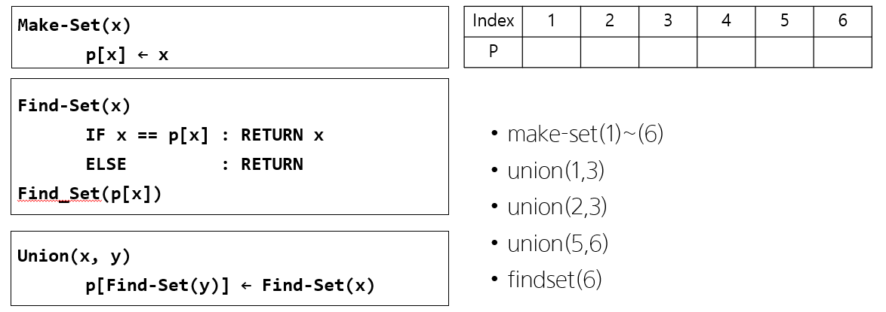

# Disjoint set(상호배타 집합, 서로소 집합)




## 1. 기본 정의

[여기](https://ko.wikipedia.org/wiki/%EC%84%9C%EB%A1%9C%EC%86%8C_%EC%A7%91%ED%95%A9_%EC%9E%90%EB%A3%8C_%EA%B5%AC%EC%A1%B0)를 참고하여 `make_set`, `union`, 그리고 `find_set` 연산의 의미를 간단하게 작성하시오.


`make_set`


`union`


`find_set`


## 2. 아래 연산을 수행한 결과를 표 or 값으로 나타내시오.

- **단계 별로 그림을 그려보세요.**


`make_set`

- **make_set(1) ~ make_set(6)**

    | Index |  1   |  2   |  3   |  4   |  5   |  6   |
    | :---: | :--: | :--: | :--: | :--: | :--: | :--: |
    |   p   |      |      |      |      |      |      |


`union`

- **union(1, 3)**

    | Index |  1   |  2   |  3   |  4   |  5   |  6   |
    | :---: | :--: | :--: | :--: | :--: | :--: | :--: |
    |   p   |      |      |      |      |      |      |

- **union(2, 3)**
	
    | Index |  1   |  2   |  3   |  4   |  5   |  6   |
    | :---: | :--: | :--: | :--: | :--: | :--: | :--: |
    |   p   |      |      |      |      |      |      |
    
- **union(5, 6)**
	
    | Index |  1   |  2   |  3   |  4   |  5   |  6   |
    | :---: | :--: | :--: | :--: | :--: | :--: | :--: |
    |   p   |      |      |      |      |      |      |


`find_set`

- **find_set(6)**
	| Index |  1   |  2   |  3   |  4   |  5   |  6   |
	| :---: | :--: | :--: | :--: | :--: | :--: | :--: |
	|   p   |      |      |      |      |      |      |
	
- **find_set(3)**

  | Index |  1   |  2   |  3   |  4   |  5   |  6   |
  | :---: | :--: | :--: | :--: | :--: | :--: | :--: |
  |   p   |      |      |      |      |      |      |

- **find_set(2)**
  | Index |  1   |  2   |  3   |  4   |  5   |  6   |
  | :---: | :--: | :--: | :--: | :--: | :--: | :--: |
  |   p   |      |      |      |      |      |      |
  


## 3. 코드 구현

```python
def make_set(x):
    pass

def find_set(x):
    pass

def union(x, y):
    pass

#1.
p = [0] * (6+1)

print(p)
print('----------------------------------')

#2.
union(1, 3)
print(p)
print('----------------------------------')

union(2, 3)
print(p)
print('----------------------------------')

union(5, 6)
print(p)
print('----------------------------------')

#3.
print(find_set(6))
print(find_set(3))
print(find_set(2))
```

