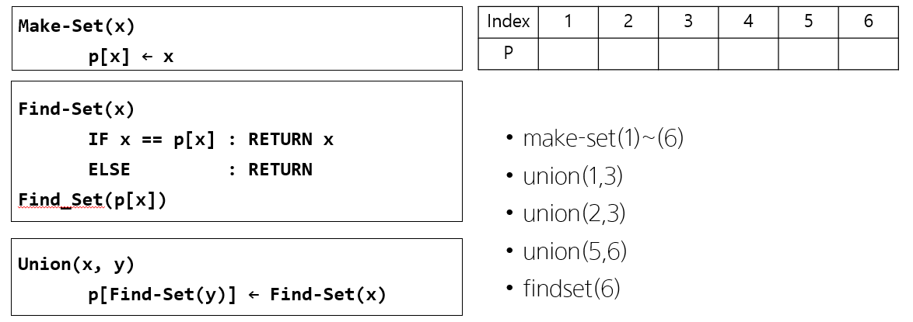

# Disjoint set(상호배타 집합, 서로소 집합)



아래 연산을 수행한 결과를 표 or 값으로 나타내시오.


`make_set`

- **make_set(1) ~ make_set(6)**

    | Index |  1   |  2   |  3   |  4   |  5   |  6   |
    | :---: | :--: | :--: | :--: | :--: | :--: | :--: |
    |   p   |  1   |  2   |  3   |  4   |  5   |  6   |


`union`

- **union(1, 3)**

    | Index |  1   |  2   |  3   |  4   |  5   |  6   |
    | :---: | :--: | :--: | :--: | :--: | :--: | :--: |
    |   p   | 1 | 2 | 1 | 4 | 5 | 6 |

- **union(2, 3)**
	
    | Index |  1   |  2   |  3   |  4   |  5   |  6   |
    | :---: | :--: | :--: | :--: | :--: | :--: | :--: |
    |   p   |  2   |  2   |  1   |  4   |  5   |  6   |
    
- **union(5, 6)**
	
    | Index |  1   |  2   |  3   |  4   |  5   |  6   |
    | :---: | :--: | :--: | :--: | :--: | :--: | :--: |
    |   p   |  2   |  2   |  1   |  4   |  5   |  5   |


`find_set`

- **find_set(6)**

  - 6의 대표 원소는 5
  - 5의 대표 원소는 5

  | Index |  1   |  2   |  3   |  4   |  5   |  6   |
  | :---: | :--: | :--: | :--: | :--: | :--: | :--: |
  |   p   |  2   |  2   |  1   |  4   |  5   |  5   |

- **find_set(3)**

  - 3의 대표 원소는 1
  - 1의 대표 원소는 2
  - 2의 대표 원소는 2

  | Index |  1   |  2   |  3   |  4   |  5   |  6   |
  | :---: | :--: | :--: | :--: | :--: | :--: | :--: |
  |   p   |  2   |  2   |  1   |  4   |  5   |  5   |

- **find_set(2)**

  - 2의 대표 원소는 2

  | Index |  1   |  2   |  3   |  4   |  5   |  6   |
  | :---: | :--: | :--: | :--: | :--: | :--: | :--: |
  |   p   |  2   |  2   |  1   |  4   |  5   |  5   |


**코드 구현**

```python
def make_set(x):
    p[x] = x

def find_set(x):
    # 반복 구조 
    # while x != p[x]:
    #     x = p[x]
    # return x
    
    # 재귀 구조
    if p[x] != x:
        p[x] = find_set(p[x])
    return p[x]

def union(x, y):
    x, y = find_set(x), find_set(y)
    p[find_set(y)] = find_set(x)

#1.
p = [0] * (6+1)
for i in range(7):
    make_set(i)

# p = list(range(7))
print(p)
print('----------------------------------')

#2.
union(1, 3)
print(p)
print('----------------------------------')

union(2, 3)
print(p)
print('----------------------------------')

union(5, 6)
print(p)
print('----------------------------------')

#3.
print(find_set(6))
print(find_set(3))
print(find_set(2))
```