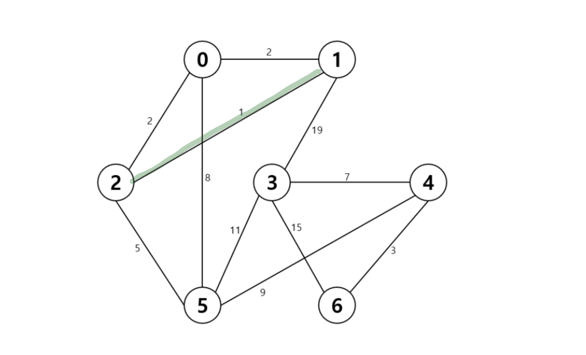
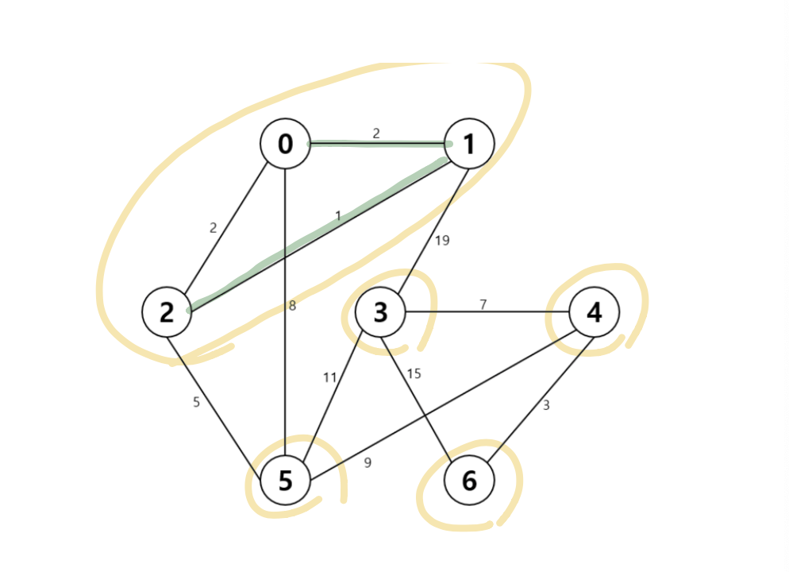
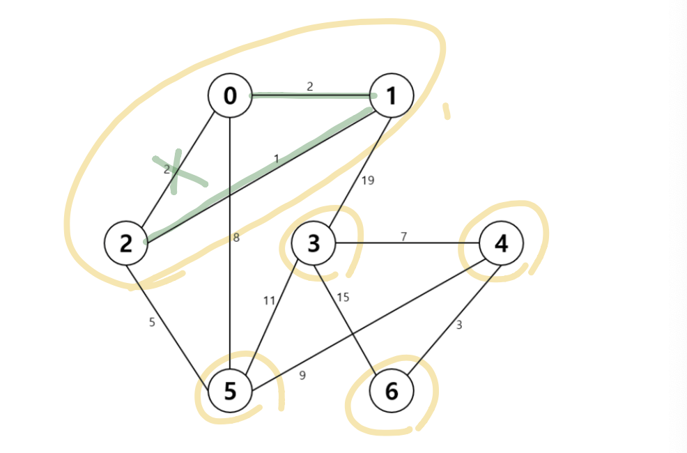
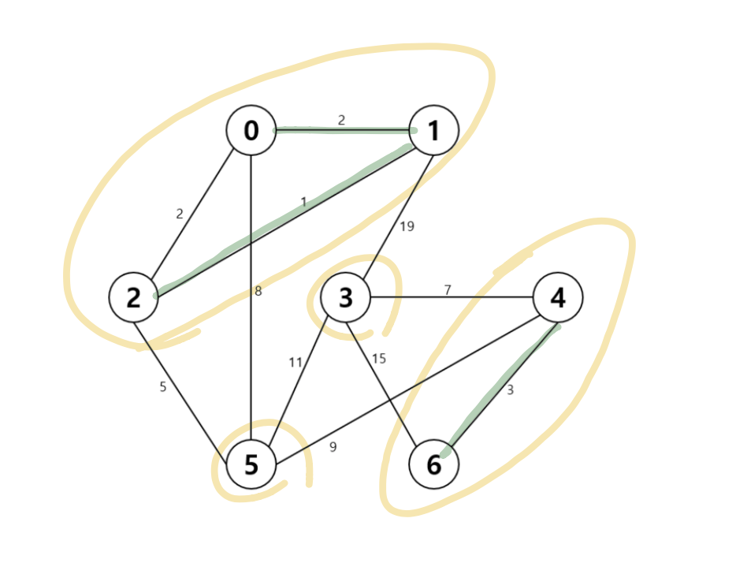
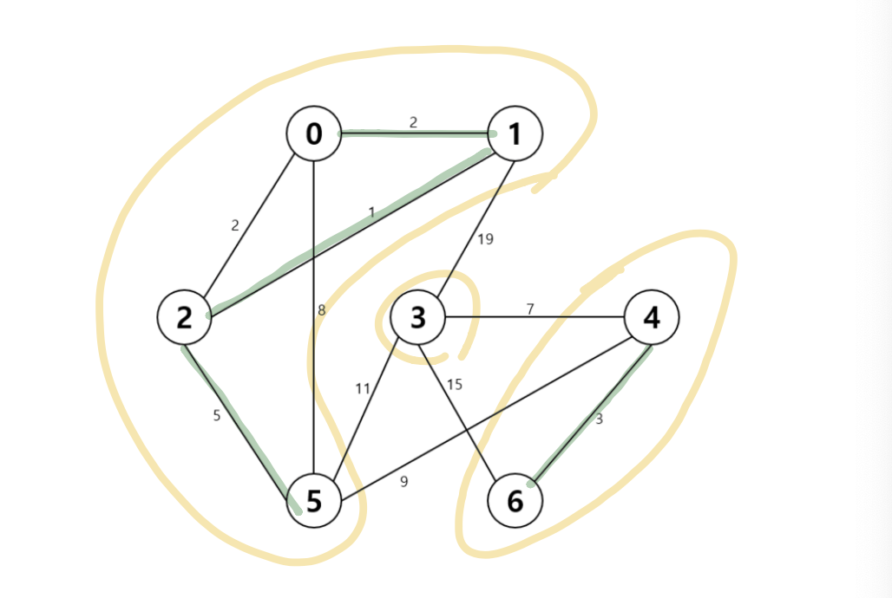
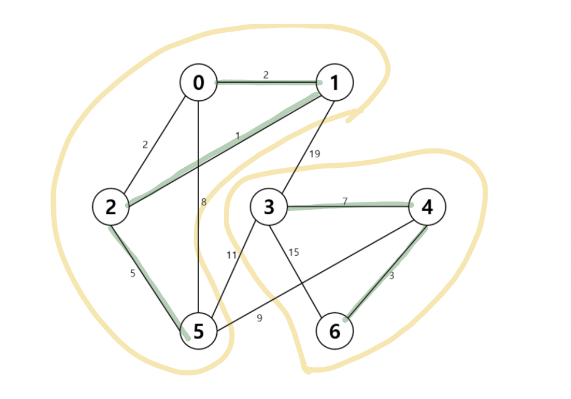
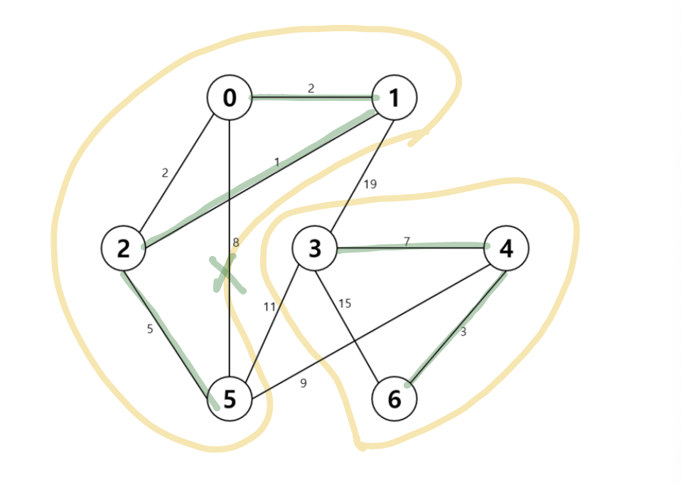
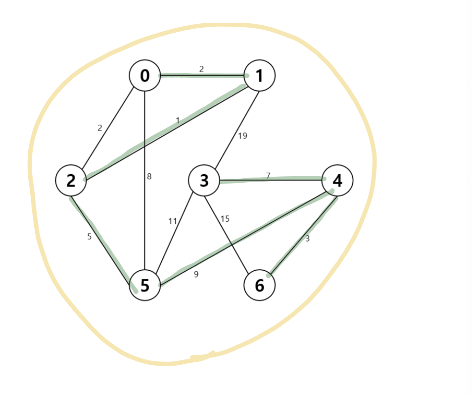
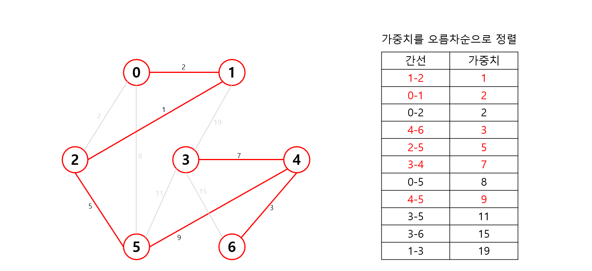

# Kruskal

### 개념

간선을 하나씩 선택하여 MST를 찾는 알고리즘

1) 최초 모든 간선을 가중치에 따라 오름차순 정렬

2. 가중치가 가장 낮은 간선부터 차례대로 선택
   - 사이클이 존재하는 경우 다음으로 가중치가 낮은 간선 선택
3. n-1개의 간선이 선택될 때까지 2번을 반복 수행

참고) 최소 비용으로 간선을 통해 모든 정점을 다 이을 때 활용합니다. 즉, 모든 정점을 다 이었을 때 간선의 가중치의 합을 최소라고 부를 수 있습니다. 하지만 임의의 두 정점을 잡았을 때 정점 간의 간선의 가중치가 최소인지는 알 수 없습니다. 

**정점 & 가중치 정보 입력**

- 간선을 기준으로 선택
- Spanning Tree에서는 정점이 `n`개 일 때 간선은 `n-1`개이기 때문에 간선의 개수를 체크하다가 `정점 개수-1`이 되는 순간에 끝내자

| 간선  | 가중치 |
| ----- | ------ |
| 0 - 1 | 2      |
| 0 - 2 | 2      |
| 0 - 5 | 8      |
| 1 - 2 | 1      |
| 1 - 3 | 19     |
| 2 - 5 | 5      |
| 3 - 4 | 7      |
| 3 - 5 | 11     |
| 3 - 6 | 15     |
| 4 - 5 | 9      |
| 4 - 6 | 3      |

**최초 모든 간선의 가중치를 중심으로 오름차순 정렬**

1. 최초 모든 간선을 가중치에 따라 오름차순 정렬

2. 가중치가 가장 낮은 간선부터 선택하면서 트리를 증가 시킴
   - 사이클이 존재하면 다음으로 가중치가 낮은 간선 선택

3. n-1개의 간선이 선택될 때까지 2번을 반복

가중치를 중심으로 오름차순 정렬 완료

| 간선  | 가중치 |
| ----- | ------ |
| 1 - 2 | 1      |
| 0 - 1 | 2      |
| 0 - 2 | 2      |
| 4 - 6 | 3      |
| 2 - 5 | 5      |
| 3 - 4 | 7      |
| 0 - 5 | 8      |
| 4 - 5 | 9      |
| 3 - 5 | 11     |
| 3 - 6 | 15     |
| 1 - 3 | 19     |

**Step 1.**
- 오름차순으로 정렬된 첫 번째 간선의 그룹을 선택
- 1 - 2 간선 선택 -> 그룹화
  

**Step 2.**

- 0-1 간선 선택 -> 그룹화
- 그룹이 총 5개로 만들어짐

**Step 3.**
- 0 - 2 간선을 선택하면 사이클 생성 -> pass
  - 사이클: 시작한 정점에서 끝나는 경로
- 넘어가고 다음 간선을 선택

**Step 4.**
- 4 - 6 간선 선택 -> 그룹화
- 현재까지 총 0-1-2 / 3 / 5 / 4-6 이렇게 4개의 그룹 형성

**Step 5.**
- 2 - 5 간선 선택 -> 그룹화
- 0-1-2-5 / 3 / 4-6 그룹 생성

**Step 6.**
- 3 - 4 간선 선택 -> 그룹화
- 0-1-2-5 / 3-4-6 그룹 생성

 

**Step 7.**
- 0 - 5를 선택하면 사이클 형성 -> pass
- 0-1-2-5 / 3-4-6 그룹 생성

 

**Step 8.**
- 4 - 5 간선 선택 -> 그룹의 대표자가 일치하지 않음 -> 그룹화
- 간선을 총 6개 선택 
- **`정점- 1`이 간선의 개수이고 간선의 개수만큼 선택을 했으면 종료**

**지금까지 만들어 놓은 가중치 정보의 총 합 27이 가중치의 최솟값이 된다.**
- 정렬을 구성하는 방식에 따라 그래프의 모양은 바뀔 수 있다.
- 예를 들어, 그림에서 `0-1` 간선이 아닌 `0-2` 간선을 선택하는 것도 가능하기 때문에 그럴 경우 그래프의 모양이 바뀐다.
- 하지만 가중치의 합이 최소가 되는 것은 동일하다.

